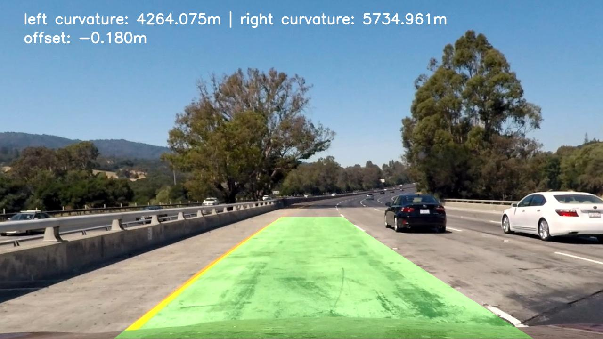

# Finding Lane Lines on the Road using OpenCV
Finding Lane Lines on the Road using OpenCV

Raw image/video source: Udacity Nanodegree Self-Driving Car Engineer https://github.com/udacity/CarND-Advanced-Lane-Lines

=======
Image/video source: Udacity Nanodegree Self-Driving Car Engineer https://github.com/udacity/CarND-Advanced-Lane-Lines

>>>>>>> 1a9868f560462bf1ae1da853640fc2548db410a3

