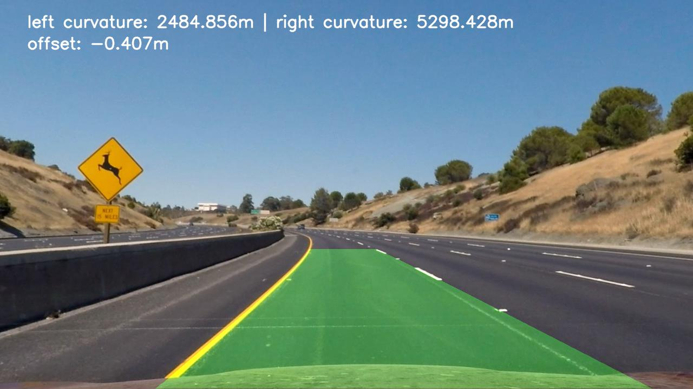

# Finding Lane Lines on the Road using OpenCV (Advanced)
---
**Objectives:**

The goals of this project are the following:

* Detect lane lines on the road from the original image/video
* Highlight the current lane on the output image/video 
* Calculate curvatures and center offset based on the detected lane lines

---

### Reflection:

#### 1. Implementation

My pipeline consisted of 6 main steps following the order below: 

    1. Undistort original image
    2. Apply gradient threshold and color threshold on undistorted image
    3. Apply perspective transformation on thresholded binary image
    4. Analyze warped image to detect leftlane and rightlane pixels
    5. Fit a polynomial curve for each left and right lane 
    6. Calculate curvatures and center offset
    - Pre-processing: Perform camera calibration
    - Post-processing: Highlight laneline area on the undistorted image
---
    Note: 
    - I also defined an ROI region beforehand and its perspective transformation to 'bird-eye' view. I wrote perspective_generator.py just for testing perspective transformation.
    - I calculate center_offset by subtracting the middle pixel (x_i = 1280/2) of the image by the middle pixel of the lane (x_l = x_mean of the two lane lines at y=720). 

#### 2. Potential Issues

My detector is still having some issues, including:
- The detector is quite slow 
- Sometimes, the calculated curvature is a bit higher than expected.
- I have not implemented sanity check for my laneline detector. 
  As a result, sliding windows is only used once at the beginning of the video
- My detector failed miserably with the challenge videos. 

#### 3. Future Improvements

Even though the detector performs well on the project video, there are still a lot of areas that I need to work on to make my detector more stable and robust. Firstly, I need to add a sanity check mechanism so that the detector can recover from failure. Secondly, I need to use weighted average to stablize the polynomial curves as result of the detector. Finally, it is necessary to spend more time on fine-tuning all of my hyper-parameters. I hope that, by the end of this program, I will manage to improve my lane-line detector so that it can beat the challenge video and harder challenge video.

